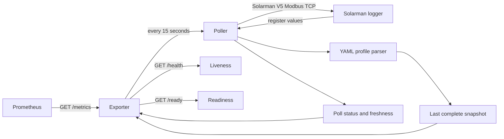

# Solarman exporter flow

```mermaid
flowchart LR
    Prometheus[Prometheus] -->|GET /metrics| Exporter
    Exporter -->|every 15 seconds| Poller
    Poller -->|Solarman V5 Modbus TCP| Logger[Solarman logger]
    Logger -->|register values| Poller
    Poller --> Parser[YAML profile parser]
    Parser --> Cache[Last complete snapshot]
    Cache --> Exporter
    Poller --> Status[Poll status and freshness]
    Status --> Exporter
    Exporter -->|GET /health| Liveness
    Exporter -->|GET /ready| Readiness
```
